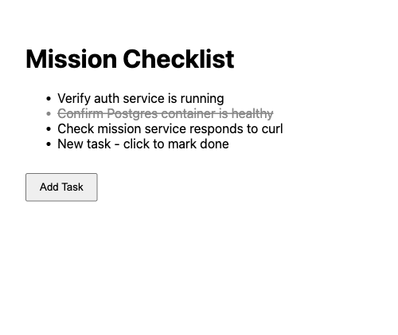
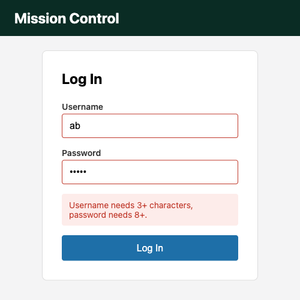
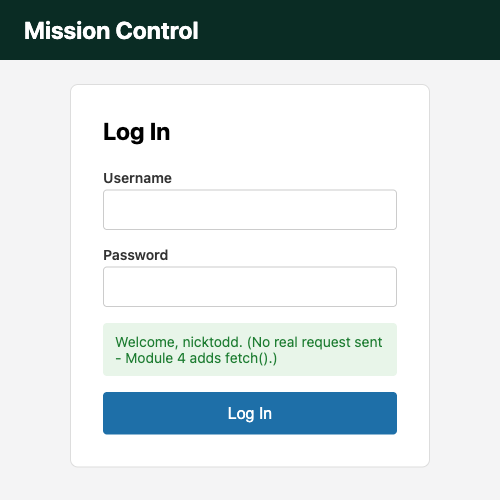

# Module 5 Demo Guide - JavaScript in the Browser: The DOM, Events & the Window Object

**Duration:** 40 minutes
**Prerequisite:** Module 2's styled login page. No prior JavaScript assumed - the first 10
minutes are the language itself, fast and narrow, before today gets into the browser at all.

Nobody has seen JavaScript yet. Today covers the core language syntax first, then the
browser-specific ideas (the DOM, events, `window`) that don't exist in any other language
this programme has used.

## Part 0: JavaScript, Fast (10 min)

Just enough syntax to read everything else today and in Module 4 - not a full language tour.

**`const` and `let`** - `const` for anything never reassigned (the strong default); `let`
for anything that is. Both are block-scoped, unlike older `var`:

```javascript
const name = "alice";   // never reassigned
let attempts = 0;       // will be reassigned below
attempts = attempts + 1;
```

**Arrow functions** - a shorter way to write a function, and the form almost all callback-style
code uses:

```javascript
function double(n) { return n * 2; }   // ordinary function
const doubleArrow = (n) => n * 2;      // same thing, arrow form, implicit return
const logIt = () => { console.log("ran"); }; // braces needed once there's a body, not a single expression
```

**Template literals** - backtick strings with `${...}` interpolation, instead of `+`
concatenation:

```javascript
const count = 3;
console.log(`Found ${count} tasks`); // "Found 3 tasks"
```

**Array methods that take a function** - `.forEach()` runs a function once per element;
plenty of other array methods (`.map()`, `.filter()`) follow the exact same shape, a function
passed *as a value* to another function:

```javascript
const tickers = ["ULVR.L", "AAPL", "MSFT"];
tickers.forEach((ticker) => {
  console.log(ticker);
});
```

**Callbacks** - that "function passed as a value" idea, generalised: anywhere a function
accepts another function and calls it later, that's a callback. `addEventListener` (Part 2)
and `.forEach()` above are both just callbacks with different names for when they run.

That's the whole vocabulary today needs. Everything from here on is these five ideas, applied
to a browser instead of a terminal.

## Part 1: What Is the DOM, and How Is a Browser Different From Node? (3 min)

When a browser loads HTML, it doesn't just display the text - it builds a live, in-memory
tree of objects called the **DOM** (Document Object Model). Every tag becomes a *node* in
that tree, and JavaScript can read and change those nodes while the page is showing.

This is the single biggest difference from a plain JavaScript/Node.js environment:

- **Node.js**: no DOM, no `window`, no browser at all - just `console`, files, and
  whatever npm packages you bring in.
- **Browser**: no filesystem access, no `require()` of arbitrary modules - but a live
  `document` tree, a `window` object, and events the user actually triggers.

Open `login-page.html`'s DevTools (right-click → Inspect → Elements tab, Module 1's own
technique) and point at the tree structure there - that tree *is* the DOM, and it's exactly
what `document` refers to in JavaScript.

## Part 2: Selecting Elements (4 min)

Open `elements-demo.html` and `elements-demo.js` side by side:

```javascript
// getElementById - exactly one match, fastest, oldest API
const checklist = document.getElementById("checklist");

// querySelectorAll - any CSS selector, returns a static NodeList
const tasks = document.querySelectorAll(".task");
console.log(`Found ${tasks.length} tasks`);
```

`getElementById` takes a bare id, no `#`. `querySelector`/`querySelectorAll` take any real
CSS selector - the exact same syntax Module 2 used in `styles.css` - and return the first
match or *all* matches respectively. Open the console (F12) and watch `Found 3 tasks` print
on load.

## Part 3: Handling Events (5 min)

```javascript
tasks.forEach((task) => {
  task.addEventListener("click", () => {
    task.classList.toggle("done");
  });
});
```

`addEventListener` takes an event name (`"click"`, `"submit"`, `"input"` - no `on` prefix)
and a function to run when it fires. Click a checklist item live - `classList.toggle("done")`
adds the class if it's missing, removes it if it's there; `styles.css`'s `.done` rule
(strikethrough) does the rest. No page reload, no manual style property - the class handles
the look, JavaScript just decides *when* it applies, exactly the separation of concerns
Module 2 argued for.

## Part 4: Manipulating the DOM - Creating New Elements (4 min)

```javascript
document.getElementById("add-task").addEventListener("click", () => {
  const li = document.createElement("li");
  li.textContent = "New task - click to mark done";
  li.className = "task";
  li.addEventListener("click", () => li.classList.toggle("done"));
  checklist.appendChild(li);
});
```

`createElement` makes a node that doesn't exist yet, entirely in memory - it isn't part of
the page until `appendChild` attaches it to something that already is. Click "Add Task" live:



The struck-through second item and the fourth "New task" item are both real, both clicked
live, both proof this isn't a static screenshot claim.

## Part 5: Handling the Login Form (7 min)

Open `login-page.html` and `script.js`. The form now has `novalidate` - deliberately turning
*off* the browser's own popup validation from Module 1, so JavaScript can own the entire
experience instead of fighting a native bubble for control:

```javascript
form.addEventListener("submit", (event) => {
  event.preventDefault(); // stop the browser's default full-page reload
  ...
});
```

Every HTML form's default behaviour on submit is a full page navigation - for a
single-page interaction, that's exactly the wrong thing. `event.preventDefault()` stops it,
handing control entirely to the JavaScript that follows.

```javascript
const usernameOk = username.length >= 3;
const passwordOk = password.length >= 8;

markInvalid(usernameInput, !usernameOk);
markInvalid(passwordInput, !passwordOk);

if (!usernameOk || !passwordOk) {
  showMessage("Username needs 3+ characters, password needs 8+.", "error");
  return;
}
```

Verified real output - an intentionally invalid submission, red borders and a message that
doesn't exist in the HTML at load time:



Fix the values and submit again:



Both `.message` states come from the same `<p id="message">` element - `classList.remove()`
clears the previous state, `classList.add()` sets the new one. Nothing was reloaded between
the two screenshots; the URL bar never changed.

## Part 6: The Window Object (3 min)

```javascript
console.log("script.js loaded - form element:", form);
window.addEventListener("load", () => {
  console.log("Page fully loaded, including images and stylesheets");
});
```

`window` is the global object every browser script runs inside - `document`, `console`, and
even ordinary variables declared at the top level all hang off it. `console.log` is really
`window.console.log`; the `window.` prefix is just usually left off because it's implicit,
the same way Node.js scripts never wrote `global.console.log`. `window.addEventListener`
with `"load"` fires once everything (images, stylesheets, the works) has finished - different
from a `<script>` tag simply running top-to-bottom as the HTML parser reaches it.

Two other `window` members worth naming without a live demo: `localStorage` (persists small
amounts of data between page loads - Module 19's JWT storage will use it) and `setTimeout`
(runs code after a delay) - both available in every browser script without an import.

## Part 7: Reading a Third-Party API Response (No Demo - Sets Up Module 6)

Everything today reacted to the *user*. Module 6 makes the DOM react to a *server* instead,
using `fetch()` to call this week's real auth stub and rendering whatever comes back - the
same `showMessage`-style pattern, driven by a network response instead of form input.

## Key message

Three ideas, composed: **select** an element (`getElementById`/`querySelector`), **listen**
for something happening to it (`addEventListener`), and **update** the DOM in response
(`textContent`, `classList`, `createElement`). Every interactive feature in a real web app -
Angular's included - is built from exactly this loop, just with more structure around it.

## Transition to the Lab

Learners take Module 1/2's own login page and wire it up themselves: select the form and
inputs, handle the `submit` event, validate without a page reload, and show feedback the same
way today's demo did - verified the same way, real screenshots of a real invalid and valid
submission.
