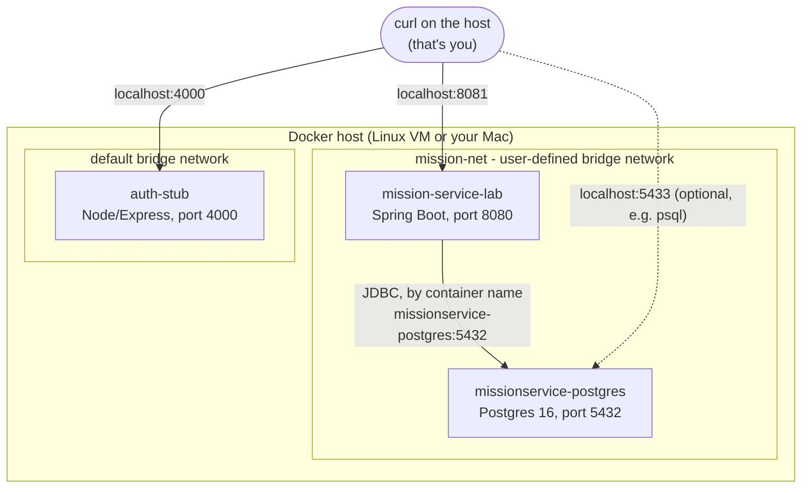

# Module 12 Lab - Containerising Spring Boot Services

## Objectives

By the end of this lab you will have:

- Written a multi-stage Dockerfile for the mission service (build stage separate from the
  runtime image)
- Run Postgres in a container for the first time this week (every earlier module used your
  local install), and run the containerised mission service alongside it on a Docker network,
  reaching Postgres by container name rather than `localhost`
- Confirmed that JWT validation needs no network connection to the auth service at all - the
  mission-service container and the auth-stub container share no Docker network between them,
  yet the mission service still validates tokens correctly

## Setup

- Access to your Linux Docker host - connect in your preferred way.
  Everything in this lab runs as a container, so Docker is all you need on that host - no local
  Java, Maven, or Node install required there.
- Given, don't modify: everything under `src/` - this is Module 11's fully working, assembled
  service. Nothing about the application code changes this module.

## Task

### Part A - Containerise Postgres

Every earlier module used your local Postgres install directly; this is the first time Postgres
itself runs in a container.

```bash
docker run -d --name missionservice-postgres -e POSTGRES_PASSWORD=mission -e POSTGRES_DB=mission \
  -p 5433:5432 postgres:16-alpine
docker cp ../../../data/shared/enterprise-schema.sql missionservice-postgres:/schema.sql
docker exec -e PGPASSWORD=mission missionservice-postgres psql -U postgres -d mission -f /schema.sql
```

(If you already created this container earlier, just make sure it's running:
`docker start missionservice-postgres`.)

### Part B - Containerise the auth stub

The mission service needs a source of JWTs to validate against. `shared/auth-stub` - a small
Node/Express service that lives two levels up from this lab folder, at the root of this
repository - already has a `Dockerfile`, so build and run it the same way you'll build and
run the mission service later in this lab:

```bash
docker build -t auth-stub:lab ../../shared/auth-stub
docker run -d --name auth-stub -p 4000:4000 auth-stub:lab
```

Deliberately **don't** put this container on `mission-net` (you'll create that network in Part
D) - leave it standalone, reachable only via its published port, `localhost:4000`. That
isolation is the point of this lab's third objective: the mission service validates a JWT purely
by checking its signature against a shared secret (`jwt.shared-secret` in
`application.properties`, matched by the auth stub's default signing secret) - it never calls
out to the auth service over the network to do that check. Keeping the two containers off the
same Docker network, and watching everything still work in Part E, is what proves it.

Confirm the stub is up before moving on:

```bash
curl -s http://localhost:4000/health
```

### Part C - Write the Dockerfile

Write a multi-stage `Dockerfile` at the root of this lab folder:

- **Stage 1 (`build`)**: base it on `maven:3.9-eclipse-temurin-21`. Copy `pom.xml` first and run
  `mvn -B dependency:go-offline` as its own layer (so Docker can cache downloaded dependencies
  separately from your source code - see Module 11's demo-guide for why that ordering matters).
  Then copy `src/`, and run `mvn -B clean package -DskipTests`.
- **Stage 2 (runtime)**: base it on `eclipse-temurin:21-jre-alpine` - no Maven, no JDK compiler,
  just enough to run a jar. Copy **only** the built jar from stage 1 (`COPY --from=build ...`).
  Expose port `8080` and set the entrypoint to run it.

### Part D - Build and Network It

```bash
docker build -t mission-service:lab .

docker network create mission-net        # if it doesn't already exist
docker network connect mission-net missionservice-postgres   # no-op if already connected

docker run -d --name mission-service-lab --network mission-net -p 8081:8080 \
  -e SPRING_DATASOURCE_URL="jdbc:postgresql://missionservice-postgres:5432/mission" \
  mission-service:lab
```

Notice the datasource URL: inside the Docker network, Postgres is reachable at
`missionservice-postgres:5432` - the container's **name**, and its **internal, unpublished** port. That's
different from every earlier module, where the JDBC URL pointed straight at your local Postgres
install (`localhost:5432`). The container's port is separately published to the host at
`localhost:5433` (see Part A's `-p 5433:5432`) purely so you can still reach it with `psql`/
pgAdmin from outside the network if you want to - the containerised service itself never uses
that published port; it reaches Postgres by container name instead.

Notice, too, what's *not* on `mission-net`: the `auth-stub` container from Part B. The mission
service can reach Postgres by container name because the two share a network - but it has no
network path at all to the auth stub, and (as Part E will show) doesn't need one.

### Part E - Verify

```bash
# No token: 401, before the container even touches Postgres
curl -si -X POST http://localhost:8081/accounts/1/orders \
  -H "Content-Type: application/json" -d '{}'

# A real order, with a real token from the auth-stub container (Part B). It's reachable at
# localhost:4000 via its published port even though it shares no Docker network with
# mission-service-lab - proof that the token check that's about to happen is local.
# The login response is JSON like {"token":"eyJ..."}; pipe it through `jq -r .token` to pull
# out just the token value (`-r` prints it raw, without surrounding quotes).
# Don't have jq? On a Mac: brew install jq
TOKEN=$(curl -s -X POST http://localhost:4000/login -H "Content-Type: application/json" \
  -d '{"username":"alice","password":"mission123"}' | jq -r .token)

curl -s -H "Authorization: Bearer $TOKEN" -X POST http://localhost:8081/accounts/1/orders \
  -H "Content-Type: application/json" \
  -d '{"ticker":"ULVR.L","instrumentType":"EQUITY","quantity":5,"price":40.0,"side":"BUY"}'
```

Then confirm the write actually landed:

```bash
docker exec -e PGPASSWORD=mission missionservice-postgres psql -U postgres -d mission -c \
  "SELECT h.account_id, i.ticker, h.quantity FROM holdings h JOIN instruments i ON h.instrument_id=i.instrument_id WHERE h.account_id=1 AND i.ticker='ULVR.L';"
```

## Deliverable

`Dockerfile`, at the root of this lab folder.

## Acceptance criteria

- `docker build` succeeds
- The container starts and stays up (`docker ps` shows it running, not restarting)
- A request with no token returns `401`
- A valid order, submitted with a real token from the auth-stub container, returns `200` and the
  new holding quantity is genuinely persisted in Postgres - confirmed by querying the database
  directly, not just trusting the HTTP response

## How It All Fits Together

By the end of Part E you have four containers running (`missionservice-postgres`, `auth-stub`,
`mission-service-lab`, plus whatever's left from earlier modules), split across two separate
Docker networks, plus the host itself:



Note what's missing from that picture: there is no arrow anywhere between `mission-service-lab`
and `auth-stub`. They sit in different subgraphs - different Docker networks - and nothing
connects them directly. Every arrow into a container comes either from `curl` on the host (via a
published port) or from `mission-service-lab` to `missionservice-postgres` (via `mission-net`).

Two request paths run through this, and they behave completely differently:

- **Getting a token** (`curl … localhost:4000/login`) never touches `mission-net` at all. It's a
  plain host-to-container call over the port `auth-stub` published, exactly like calling any
  ordinary web service. `mission-service-lab` isn't involved in this step in any way.
- **Placing an order** (`curl … localhost:8081/accounts/1/orders`) reaches
  `mission-service-lab` over *its* published port. From there:
  1. Spring Security decodes the `Bearer` token from the `Authorization` header and checks its
     signature against `jwt.shared-secret` - a value baked into the jar at build time, not
     fetched from anywhere. Validating a JWT is just checking a cryptographic signature, so the
     two containers never speak to each other, on any network, to do it.
  2. Only once that check passes does `mission-service-lab` talk to Postgres - and it does that
     over `mission-net`, by container name (`missionservice-postgres:5432`), the same way any two
     containers on a shared user-defined network find each other by DNS.

So the two networks aren't an accident of setup order - they're a direct, visible consequence of
which containers actually need to talk to which others. `mission-net` exists because
`mission-service-lab` and `missionservice-postgres` genuinely exchange data (SQL over JDBC) on every
request. `auth-stub` has no such relationship with either of them, so it sits outside that
network entirely, and the only thing connecting it to the rest of this setup is you, curling
both of them from the host.
